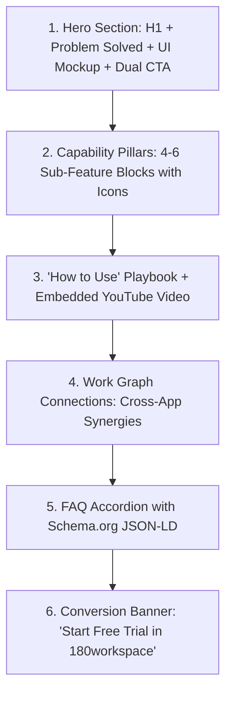

# 180workspace Feature Page & Public Documentation Standards

**Status:** Enforced  
**Applies to:** `apps/marketing-web`, `apps/docs`, and all AI agents or developers adding or updating feature pages, product guides, and developer portals.

---

## 1. Core Architecture Principles

1. **Product Experience Landing Pages over Plain Docs:**
   - Public-facing user guides, feature documentation, and walkthroughs are hosted as **Product Experience Pages** under `/apps/[slug]` in `apps/marketing-web`.
   - Never create isolated, unstyled text documentation for customer-facing features. Every app page must serve both as an **SEO-optimized discovery landing page** and an **actionable step-by-step user guide**.

2. **Public vs. Internal Separation:**
   - **`apps/marketing-web/src/pages/apps/[slug].astro`:** Public-facing feature playbooks, sub-feature capabilities, YouTube video tutorials, FAQ accordions, and Work Graph synergies.
   - **`apps/marketing-web/src/pages/developers/[slug].astro`:** Public REST API references, Webhook schemas, SDK guides, and Custom CNAME SSL setup.
   - **`apps/docs/`:** Internal confidential engineering blueprints, database schemas, local setup runbooks, and future roadmap specifications (git-only).

---

## 2. Mandatory 6-Tier Page Structure

Every page under `/apps/[slug]` MUST implement all six architectural tiers:

### 1. Hero Section (`<AppHero />`)
- **H1 Headline:** High-impact, benefit-driven (e.g. *"Automate Your Entire Deal Pipeline with 180 CRM"*).
- **Subheadline:** Clear problem-solution statement.
- **Primary CTA:** Link to SaaS signup (`https://app.180workspace.com/signup`).
- **Secondary CTA:** Interactive demo / anchor jump to step-by-step video walkthrough.
- **Visual Asset:** High-resolution product mockup with glassmorphism backdrop.

### 2. Capability Pillars (`<CapabilityPillars />`)
- 4 to 6 structured cards detailing specific sub-modules.
- Each card must include an icon, bold title, concise description, and feature tag.

### 3. "How to Use" Playbook & Video Walkthrough (`<VideoPlaybook />`)
- Responsive YouTube video player embed (`iframe` with `aspect-video`).
- 3 to 4 sequential numbered steps explaining how to configure and use the feature in production.

### 4. Work Graph Synergy (`<WorkGraphSynergy />`)
- Explain how this application automatically shares data, triggers events, and coordinates with other 180workspace applications (CRM, HR, Finance, Projects, Traffic Director, AI).

### 5. SEO & FAQ Accordion (`<FAQAccordion />` & `<JSONLDSchema />`)
- 5 to 7 real-world questions addressing common customer problems, integration steps, and edge cases.
- Injected with valid `FAQPage` and `SoftwareApplication` JSON-LD schema for Google Rich Results.

### 6. Conversion Banner (`<AppBottomCTA />`)
- High-contrast banner with primary CTA button and risk-free trial messaging (*"No credit card required • Instant setup"*).

---

## 3. SEO & AIO (Artificial Intelligence Optimization) Standards

To ensure top rankings in Google, Bing, Perplexity, ChatGPT, and Gemini:

1. **Target Keyword Density:** Incorporate high-intent commercial keywords organically in H1, H2, meta titles, and FAQ questions.
2. **Metadata Specifications:**
   - `title`: `"[App Name] Software & Guide | 180workspace"`
   - `description`: 150-160 characters describing the core value proposition and workflow.
   - `openGraph` & `twitterCard`: Fully populated with title, description, and preview image.
3. **Structured Data:** Every app page must render `<JSONLDSchema />` containing `SoftwareApplication`, `Offer`, and `FAQPage` schemas.

---

## 4. Design & Aesthetics Guidelines

- **Typography:** Outfit / Satoshi headings with tight tracking (`tracking-tight font-black`), clean slate/gray body text (`text-slate-600 dark:text-slate-300`).
- **Glassmorphism:** `backdrop-blur-xl bg-white/70 dark:bg-slate-900/70 border border-slate-200/80 dark:border-slate-800`.
- **Gradients:** Subtle, tailored color accents matching each app's domain (e.g., Blue for CRM, Violet for AI Copilot, Emerald for Finance, Amber for Projects).
- **Responsiveness:** 100% mobile-first with touch-friendly accordions and fluid grids.
