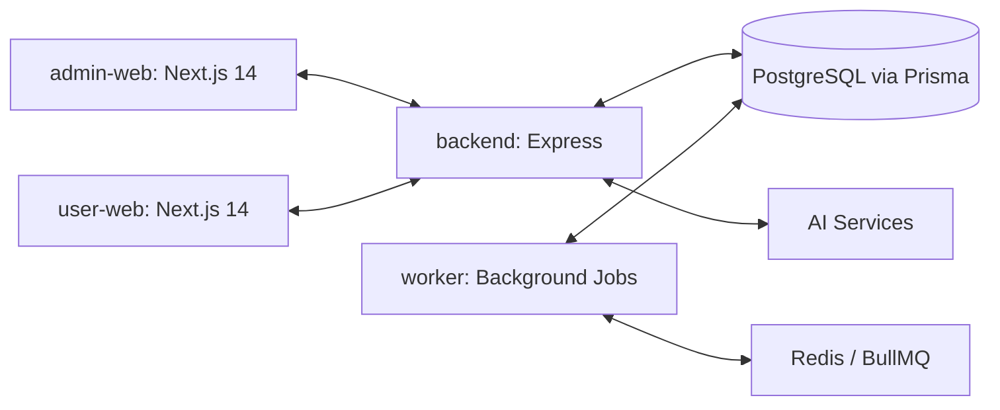

# Pitchin180 Platform (180workspace)

A comprehensive, production-ready, white-labeled solution for managing organizational operations. Built with a modern Turborepo monorepo architecture and enhanced with AI capabilities.

---

## 🏗️ Architecture



This project is a **Turborepo** monorepo using **pnpm**, structured as follows:

- `apps/frontend`: Next.js user app for 180workspace.
- `apps/admin-web`: Next.js internal admin for 180workspace.
- `apps/backend`: Core API for 180workspace.
- `apps/ws`: Real-time WebSockets for 180workspace.
- `apps/worker`: Heavy background jobs for 180workspace.
- `apps/pitchin180-frontend`: Public Network & Profiles app.
- `apps/pitchin180-admin-web`: Community Moderation Admin for Pitchin180.
- `apps/pitchin180-backend`: Core API / Graph Queries for Pitchin180.
- `apps/pitchin180-worker`: Graph aggregations and background jobs for Pitchin180.
- `packages/*`: Shared utilities, UI components, ESLint/TypeScript configs, and Prisma Database schema.

---

## ✨ Key Features

- **🧩 Hybrid Intelligence Strategy**: 
  - **Deterministic Analytics Engine**: Mathematical algorithms for precise scoring (Risk, Priority, Productivity).
  - **Optimized Resource Scaling**: AI is reserved for complex NLP (Summarization, Drafting).
- **🛡️ White-Labeling & Dynamic Branding**: Customizable branding via system settings. Update logos, colors, and names across the platform.
- **🤖 AI-Powered NLP**:
  - **AI Doc Chat & Magic Write**: AI-assisted drafting and professional communication tools.
- **⚡ Smart Automation System**:
  - **Predictive Risk & Priority**: Scored via deterministic algorithms.
  - **Scheduler (Cron)**: Automated salary generation, attendance alerts, and deadline reminders.
- **💼 HRMS & Operations**:
  - Employee lifecycle management, recruitment, onboarding, and payroll.
  - Advanced financial reporting with soft-delete data integrity.
- **💬 Real-Time Collaboration**: Instant chat and system-wide notifications.

---

## 🚀 Quick Start

### Prerequisites
- Node.js 18+
- [pnpm](https://pnpm.io/installation) package manager
- PostgreSQL and Redis running locally or via Docker

### 1. Configure Environment Variables
Environment files have been streamlined for all apps:
```bash
# For local development, copy the examples:
cp apps/frontend/.env.example apps/frontend/.env
cp apps/admin-web/.env.example apps/admin-web/.env
cp apps/backend/.env.example apps/backend/.env
cp apps/worker/.env.example apps/worker/.env
```

### 2. Install Dependencies
From the root of the workspace, run:
```bash
pnpm install
```

### 3. Database Setup (Prisma)
Navigate to the db package to push your schema and seed the database:
```bash
cd packages/db
pnpm dlx prisma db push
pnpm run seed
cd ../..
```

### 4. Run the Development Server
Use Turborepo to start all applications simultaneously:
```bash
pnpm dev
```
- **Admin Web**: `http://localhost:3001`
- **User Web**: `http://localhost:3000`
- **Backend API**: `http://localhost:4000`

---

## 👤 Credits & Support
Developed for Enterprise Management Efficiency.
[GitHub Repository](https://github.com/Prince364133/Pitchin180-Platform)

