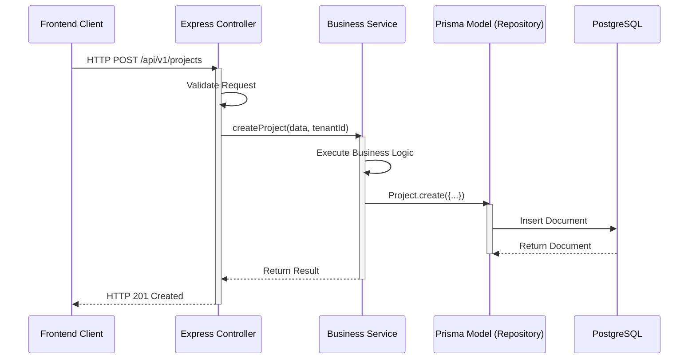

# Backend Architecture (Express.js)

The `http-backend` is built using Express.js and strictly follows the **Controller-Service-Repository** architectural pattern.

## 1. The Controller Layer
Located in `src/controllers/`, this layer is exclusively responsible for handling HTTP requests and responses. 
- It extracts parameters, query strings, and body data from the `req` object.
- It calls the appropriate Service function.
- It returns the formatted HTTP response (e.g., `res.status(200).json(...)`).
- **Rule:** Controllers should NEVER contain business logic or direct database queries.

## 2. The Service Layer
Located in `src/services/`, this is where the core business logic resides.
- Services handle complex calculations, third-party API calls (e.g., Stripe, Groq), and orchestration.
- A Service function might call multiple Models/Repositories.
- This layer makes the code highly testable because business logic is decoupled from HTTP context.

## 3. The Repository Layer (Prisma Models)
Located in `src/models/`, these define the data schemas and handle database interactions using Prisma.
- Defines the schema, indexes, and validation rules.
- Contains Prisma middleware (pre/post save hooks).
- Represents the only layer that should directly interact with PostgreSQL.

## 4. Multi-Tenant Middleware
Located in `src/middleware/tenant-db.js`.
Because the IMS platform serves multiple companies (tenants), this middleware is injected into protected routes.
- It extracts the `companyId` from the authenticated user's JWT.
- It attaches the tenant context so queries only retrieve data belonging to that specific company.

## 5. Error Handling
Located in `src/middleware/error.js`.
All asynchronous controller functions should be wrapped in a `catchAsync` utility. When an error is thrown, it is caught and forwarded to this centralized error handler, which formats a standard JSON error response and sends the error stack to Sentry (in production).
