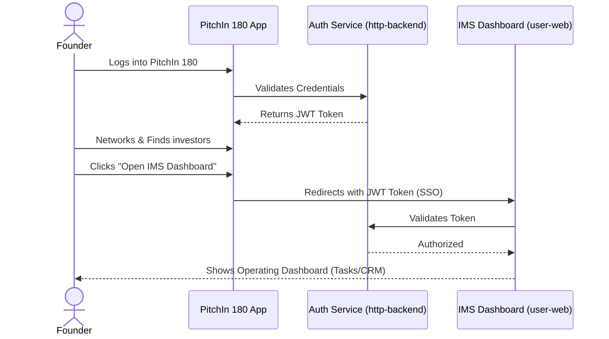

# Dual-App Strategy

The IMS ecosystem is uniquely designed around a "Dual-App Architecture", separating the public networking experience from the private operating workspace.

## 1. PitchIn 180 (The Network Hub)
PitchIn 180 is the dedicated app for the ecosystem. It acts as the "LinkedIn for Startups."
- **Focus:** Networking, community Q&A, hiring, events, and finding investors.
- **Monetization:** Sponsor placements, event ticketing, and potentially recruiter fees.

## 2. IMS Dashboard (The Operating Engine)
The IMS Dashboard (`user-web`) is the heavy-duty SaaS tool for actually running the startup.
- **Focus:** Task management, CRM, milestones, documents, and HR.
- **Monetization:** Subscription SaaS plans for incubators, or premium tiers for founders.

## 3. The Bridge: Unified Identity (SSO)
The genius of the architecture is that they share the same backend (`http-backend`) and database (`@workspace/db`).

1. A founder creates their company profile in the PitchIn 180 app to start networking.
2. Inside PitchIn 180, there is a **Dashboard** button.
3. Clicking this button redirects the user to the IMS Dashboard (`user-web`), passing along their authentication token.
4. Because they share the same PostgreSQL database, the user is instantly logged in. Their company context is preserved, and they can immediately start managing tasks and projects without a separate signup process.

This design keeps the UIs clean and focused, while creating an incredibly "sticky" ecosystem where founders network in one app and run their daily operations in another.
