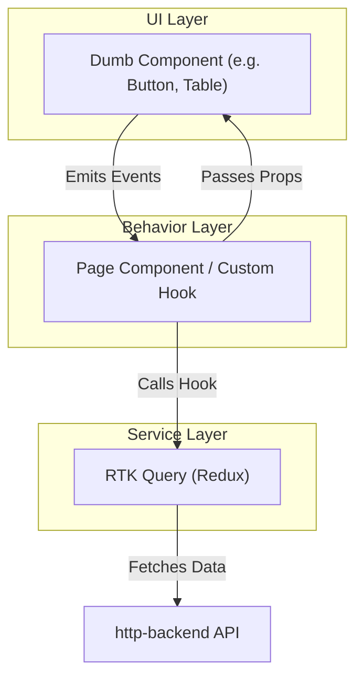

# Frontend Architecture (Next.js)

The 180workspace frontend apps (`user-web` and `admin-web`) follow a strict **3-Layer Architecture** to keep components clean, reusable, and easy to test.

## 1. The UI Layer (Components)
This layer consists of pure React components.
- **Responsibility:** Rendering HTML/Tailwind and firing events.
- **Rule:** UI components should be "dumb." They should not contain data fetching logic or complex state management. They accept data via props and emit actions via callbacks.
- **Example:** A `Button` or a `UserCard` component.

## 2. The Behavior Layer (Hooks & Pages)
This layer acts as the glue between the UI and the Services.
- **Responsibility:** Managing local state, form validation, and orchestrating API calls.
- **Rule:** This is where `useEffect`, `useState`, and custom hooks live. It prepares the data to be passed down to the UI Layer.

## 3. The Service Layer (Redux Toolkit + RTK Query)
This layer handles all external communication.
- **Responsibility:** Fetching data from the `http-backend`, caching, and global state management.
- **Implementation:** We use **RTK Query** (`createApi`) to define endpoints. This automatically generates React hooks (e.g., `useGetUsersQuery`) which are consumed by the Behavior layer.
- **Benefits:** Built-in caching, automatic re-fetching on mutations, and loading/error state management out of the box.

---

## Higher-Order Components (HOCs) for Auth
We use HOCs to protect routes in Next.js.
For example, a `withAuth` HOC wraps around page components to ensure the user has a valid JWT token before rendering the page. If no token is found, the user is redirected to the login page.
