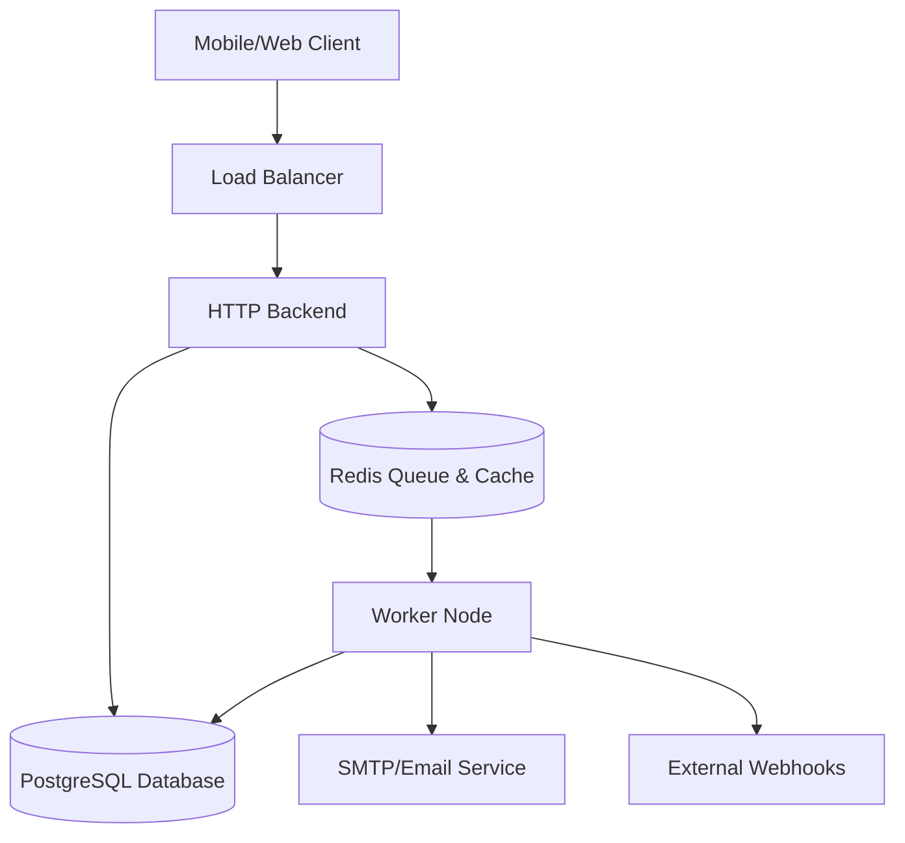

# System Overview

The 180workspace Platform is built on a scalable, cloud-agnostic architecture. It utilizes a monorepo setup managed by Turborepo and pnpm, allowing code sharing across distinct applications.

## High-Level Architecture

The platform consists of four primary deployment nodes:

### 1. HTTP Backend (API Server)
- **Role:** Handles synchronous API requests, authentication, and WebSocket connections.
- **Stack:** Node.js, Express, Socket.io, Prisma, PostgreSQL.
- **Location:** `apps/http-backend`
- **Key Feature:** Dispatches heavy, long-running tasks to the Redis queue rather than processing them inline.

### 2. Worker Node (Background Processor)
- **Role:** Consumes BullMQ jobs from Redis and executes scheduled Cron jobs.
- **Stack:** Node.js, BullMQ, node-cron.
- **Location:** `apps/worker`
- **Key Feature:** Shares the exact same codebase as the HTTP Backend but runs with `RUN_MODE=worker` to ensure complete decoupling of heavy workloads (AI analysis, email blasts) from the user-facing API.

### 3. User Web (Super App / PitchIn 180)
- **Role:** The primary interface for end-users, founders, and investors.
- **Stack:** Next.js, React, Tailwind CSS, Capacitor (for native Android/iOS deployment).
- **Location:** `apps/user-web`
- **Key Feature:** Operates as a Progressive Web App (PWA) and a native mobile wrapper. Houses both the core 180workspace features and the dedicated PitchIn 180 network module.

### 4. Admin Web (Super Admin Portal)
- **Role:** The back-office control panel for platform administrators.
- **Stack:** Next.js, React, Tailwind CSS.
- **Location:** `apps/admin-web`
- **Key Feature:** Strictly segregated from user data, providing a secure interface for monitoring system health, managing tenants, and configuring billing.

---

## Infrastructure Diagram

## Cloud Agnostic Deployment

By strictly adhering to 12-factor app principles, this entire stack can be deployed on:
- **Render** (Web Services + Background Workers)
- **Railway** (Services + Redis plugin)
- **AWS** (ECS/Fargate for containers + RDS for Postgres + ElastiCache for Redis)
- **Azure** (App Services + Azure Database for Postgres + Azure Cache for Redis)

Each application contains a standard `Dockerfile` ensuring parity across development, staging, and production environments.
