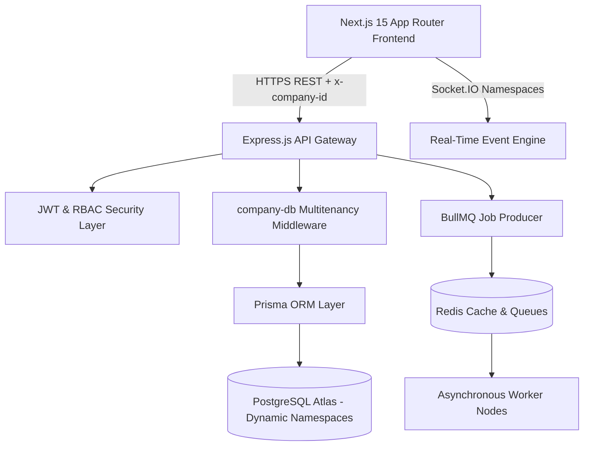

# 180workspace Platform Overview

Welcome to the **180workspace Platform Documentation**. This portal contains the internal engineering specifications, architectural blueprints, database models, and developer runbooks for the entire 180workspace ecosystem.

---

## 🎯 What is 180workspace?

**180workspace** is a unified multi-company enterprise business management and operations platform. It bridges traditionally fragmented business functions into a synchronized **Work Graph**:

- **CRM & Sales Operations:** Lead scoring, deals pipeline, customer interactions, and contact books.
- **Human Resources & Team:** Employee directory, leaves management, attendance, and automated payroll pipelines.
- **Financial Intelligence:** Invoicing, vendor bill tracking, expense categorization, and multi-currency ledger.
- **Traffic Director & Link Infrastructure:** High-velocity traffic routing, geo-targeting, web cloaking, and real-time click telemetry.
- **180 Studio & Creative Media:** Asset storage, visual timeline editing, social publishing, and AI-assisted generation.
- **Platform Work Graph Core:** Cross-app data relationships, unified notification bus, and centralized audit logging.

---

## 🏗️ Architecture at a Glance

The platform utilizes a **Modular Monolith** pattern designed for high performance, strict multi-tenant isolation, and real-time responsiveness:



### Core Technology Stack
- **Frontend Layer:** Next.js 15 (App Router, Server-Side Rendering), React 19, Tailwind CSS, Zustand, Socket.IO Client.
- **Backend API Layer:** Node.js, Express.js, TypeScript.
- **Data Persistence:** PostgreSQL with Prisma ORM, utilizing company-isolated dynamic schema switching.
- **Asynchronous Execution:** Redis with BullMQ for background job scheduling, payroll runs, and telemetry processing.
- **Security & RBAC:** Dual-token JWT architecture (short-lived access tokens, refresh tokens), helmet, rate-limiting, and sanitized inputs.

---

## 📚 Documentation Roadmap

Explore the sections below to understand each area of the system:

| Section | Focus Area | Description |
| :--- | :--- | :--- |
| [System Architecture](/docs/SYSTEM_ARCHITECTURE) | Core Design | Comprehensive modular monolith topology, data flow, and deployment models. |
| [Database Schema](/docs/DATABASE_SCHEMA) | Data Layer | Multi-company isolation, Prisma schema specifications, and relational constraints. |
| [API Documentation](/docs/API_DOCUMENTATION) | Endpoints & Contracts | RESTful API routes, request interceptors, headers, and Socket.IO namespaces. |
| [Authentication & Security](/docs/AUTHENTICATION_AND_SECURITY) | Zero-Trust RBAC | JWT lifecycle, permission matrix, and mutation audit trail logs. |
| [Local Development Runbook](/docs/getting-started/local-development) | Developer Onboarding | Monorepo pnpm workspace setup, Docker orchestration, and environment variables. |
| [Business Logic & Work Graph](/docs/BUSINESS_LOGIC) | Domain Workflows | Cross-application synergies connecting CRM, HR, Finance, and Marketing. |

---

## ⚡ Quick Start for Developers

To run the platform locally, clone the monorepo and run the following in your terminal:

```bash
# 1. Install workspace dependencies
pnpm install

# 2. Provision local environment
cp .env.example .env

# 3. Launch full monorepo development cluster
pnpm dev
```

The documentation portal runs on port `3005`, the Next.js frontend on port `3000`, the Express backend API on port `5000`, and additional micro-web apps on their dedicated ports.
