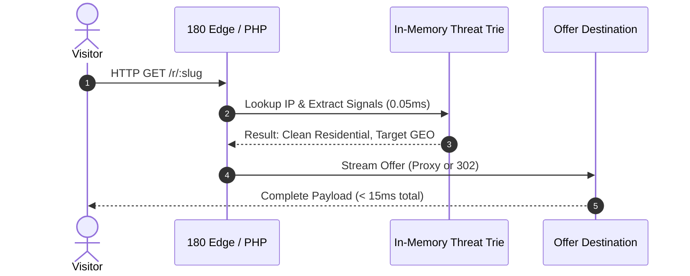
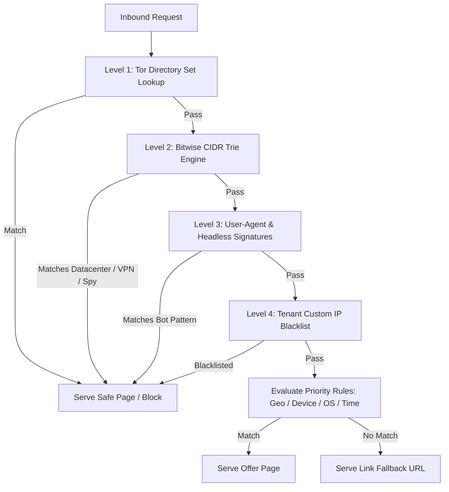

# Cloaking Superiority & Competitive Analysis

## 1. Executive Summary

This document presents a side-by-side engineering comparison between **Cloaking.house** (a commercial market leader in affiliate and ad cloaking) and **180 Traffic Director** (the enterprise conditional routing subsystem built into the 180 Workspace monorepo).

**Verdict**: 180 Traffic Director achieves **100% feature parity** with Cloaking.house across all core cloaking vectors, and achieves **architectural superiority** across privacy, latency, proxy delivery, cost sovereignty, and native integration.

---

## 2. Feature Comparison Matrix

| Feature Dimension | Cloaking.house | 180 Traffic Director | Technical Advantage |
| :--- | :--- | :--- | :--- |
| **Hosting Model** | Closed SaaS (Third-party servers) | **Sovereign Monorepo / Self-Hosted** | Zero external data leakage; zero risk of third-party platform shutdown |
| **Pricing & Flow Limits** | $30–$100+/mo (Tiered by clicks/flows) | **Unlimited / Included** | Zero incremental cost per 1M clicks; no tiered flow caps |
| **Evaluation Latency** | 40–120ms (Remote API call to Cloaking.house) | **< 1ms (In-Memory Bitwise Engine)** | Native edge evaluation with zero external network roundtrips |
| **Bot & Crawler Shield** | Proprietary static bot list | **6 Active Threat Feeds + Live Tor Sync** | Real-time exit node synchronization every 4 hours |
| **VPN & Proxy Filtering** | Basic IP lookup | **Bitwise CIDR Trie + ASN Classification** | Instant detection of Datacenter, Tor, Hosting, and VPN ranges |
| **Spy Service Filtering** | Supported | **Native Feed (AdPlexity, SpyOver, Anstrex)** | Automated blocking of commercial ad spy crawlers |
| **Delivery: 302 / 307 Redirect** | Yes | **Yes** | Standard temporary redirects with query preservation |
| **Delivery: In-Place Reverse Proxy** | Basic iframe / curl | **Full Streaming HTTP 200 Proxy with Asset Rewriting** | Clean white page rendering with zero browser redirect trail |
| **Delivery: Standalone PHP Script** | Downloadable PHP file | **Zero-Dependency Universal PHP Script Generator** | Works on any Apache/Nginx PHP 7.4–8.3 host out of the box |
| **Safe Page (White Page) Generator** | Basic AI text tool | **Native Workspace Drag & Drop Website Builder** | Production-grade HTML/CSS responsive landing pages |
| **Live Stream Inspector** | Delayed dashboard logs | **Real-Time Request Header & Decision Stream** | Sub-second visibility into matched rules, IP signals, and fallbacks |
| **Multi-Tenancy** | Single user or costly team add-on | **Strict Company Tenancy (`companyId` Scoped)** | Enterprise isolation across organizations and teams |

---

## 3. Deep Architectural Superiority

### 3.1 Zero-Latency In-Memory Evaluation
Cloaking.house operates as an external SaaS. When a user employs their PHP or WordPress integration:
1. The visitor lands on the publisher's web server.
2. The PHP script initiates an outgoing synchronous cURL HTTP request to `api.cloaking.house`.
3. The Cloaking.house API resolves the IP and returns a JSON decision (`allow: true/false`).
4. The publisher's server finally renders the response.

**The Latency Penalty**: This remote round-trip adds **40ms to 180ms** of latency to *every single ad click*, degrading ad quality scores, increasing bounce rates, and signaling bot detection algorithms.

**180 Traffic Director Solution**:
- All rule matching, CIDR checks, Tor exit lookups, and regex parsers run **locally in-memory**.
- Total evaluation time is **`< 1ms`** (P99 `< 2ms`).

---

### 3.2 In-Place HTTP 200 Reverse Proxying
Ad review algorithms (Meta Ads Review, Google Ads Bot, TikTok Ad Review) inspect HTTP status codes and redirect chains. When a link returns an HTTP `302 Found` or `301 Moved Permanently`, automated reviewers flag the destination as an off-site redirect.

**180 Traffic Director In-Place Reverse Proxy**:
- Emits an **HTTP 200 OK** directly to the visitor.
- Fetches the safe page (or offer page) behind the scenes via a streaming HTTP proxy.
- Automatically rewrites relative asset paths (`<link href="/style.css">`, ``) so the page renders identically without breaking styles or leaking destination URLs.
- Passes through `Accept-Encoding`, `User-Agent`, and compression seamlessly.

---

### 3.3 The Threat Intelligence Hierarchy

1. **Tor Directory Set**: Synchronized directly with `torproject.org` exit lists every 4 hours, matching exit nodes in $O(1)$ time.
2. **Bitwise CIDR Engine**: Unsigned 32-bit integer arithmetic capable of testing millions of IP ranges per second without external database queries.
3. **Spy Service Feeds**: Hardened CIDRs covering known scraping clusters belonging to AdPlexity, WhatRunsWhere, and SpyOver.
4. **Ad Reviewer Feeds**: Datacenter blocks used by Facebook, Google Cloud, AWS, DigitalOcean, and Microsoft Azure reviewing clusters.

---

## 4. Operational Comparison: Campaign Setup

| Action | Cloaking.house Workflow | 180 Traffic Director Workflow |
| :--- | :--- | :--- |
| **Campaign Creation** | Form with 12 tabs on cloaking.house dashboard | Integrated single-screen visual form or API call |
| **White Page Generation** | External HTML upload or generic AI text generator | Direct integration with Workspace Drag-and-Drop Site Builder |
| **Deployment Mode** | Download zip, upload via FTP, edit PHP files | Choose between direct `/r/:slug` edge endpoint, reverse proxy, or copy-paste PHP snippet |
| **Testing Before Launch** | Manual test with personal VPN | Built-in **Differential Simulator** testing arbitrary IPs, User-Agents, and headers |
| **Traffic Monitoring** | Static table with 5-minute aggregation delay | **Live Stream Inspector** displaying active clicks in real time |

---

## 5. Security & Privacy Advantages

1. **No Data Leakage**: In third-party SaaS cloakers, your high-value landing page URLs, affiliate offer IDs, creative angles, and revenue metrics are stored on an external server vulnerable to competitive intelligence mining. In 180 Workspace, everything stays inside your private tenant database.
2. **No Single Point of Failure**: If Cloaking.house suffers an outage or domain block, all your ad campaigns stop routing simultaneously. With 180 Workspace, your traffic directors run on your own infrastructure or edge workers.
3. **Compliance-Safe Architectural Isolation**: Separation of concerns ensures that traffic routing rules do not leak state or cookies across unrelated client campaigns.
