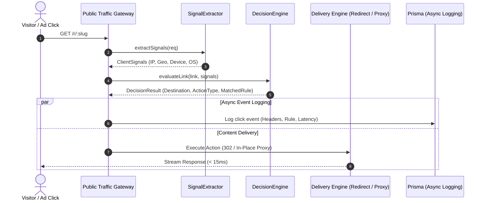

# Edge Evaluator & Reverse Proxy Architecture

## 1. Overview & Core Components

The **Edge Evaluator & Gateway** is the real-time execution environment that handles live ad clicks and redirects. When a client performs a request against a short link (`/r/:slug`) or custom branded domain, the Edge Evaluator executes four pipelined stages in sub-millisecond time:

1. **Signal Extraction**: Extracts network, hardware, and browser characteristics from HTTP headers and socket attributes.
2. **Threat & Bot Classification**: Evaluates threat feeds and custom blacklists.
3. **Rule Matrix Evaluation**: Evaluates tenant-defined multi-dimensional conditional rules in strict priority sequence.
4. **Content Delivery Execution**: Executes the chosen delivery mode (Direct HTTP Redirect, In-Place Streaming Reverse Proxy, or Standalone PHP fallback).



---

## 2. Signal Extractor (`SignalExtractor.ts`)

The `SignalExtractor` normalizes heterogeneous HTTP request environments (Cloudflare, AWS ALB, Nginx, direct Node.js sockets) into a consistent `ClientSignals` interface:

```typescript
export interface ClientSignals {
  ip: string;
  userAgent: string;
  country: string;
  city?: string;
  region?: string;
  deviceType: 'mobile' | 'desktop' | 'tablet' | 'bot';
  os: string;
  browser: string;
  referrer: string;
  language: string;
  queryParams: Record<string, string>;
  headers: Record<string, string>;
  isVpnOrProxy: boolean;
  isDatacenter: boolean;
  isTor: boolean;
  isBot: boolean;
}
```

### IP Address Resolution Priority
To prevent IP spoofing while supporting modern edge CDNs, client IP is resolved via the following priority cascade:
1. `cf-connecting-ip` (Cloudflare edge validated IP)
2. `x-real-ip` (Nginx / HAProxy trusted proxy header)
3. `x-forwarded-for` (Leftmost untrusted IP in comma-separated list)
4. `req.socket.remoteAddress` (Direct TCP socket IP fallback)

---

## 3. Decision Engine & Priority Solving

The `DecisionEngine` evaluates a link's configured rules in ascending order of `priority` (where `priority: 0` is evaluated before `priority: 1`).

### Condition Evaluation Schema
Each `TrafficRule` contains an array of criteria:
```json
{
  "type": "geo",
  "operator": "in",
  "value": ["US", "GB", "CA"]
}
```

Supported Operators:
- `eq`: Exact string or numeric equality.
- `neq`: Not equal.
- `in`: Value exists in configured array.
- `nin`: Value does not exist in array.
- `contains`: Substring match (case-insensitive).
- `regex`: Regular expression pattern matching.
- `gt` / `lt`: Numeric threshold comparisons.

---

## 4. Delivery Modes

180 Traffic Director supports three distinct delivery modes depending on campaign risk profile and platform requirements:

### Mode 1: Direct HTTP Redirect (302 / 307)
- **Status Code**: `302 Found` or `307 Temporary Redirect`.
- **Latency**: Near zero (`< 1ms`).
- **Parameter Forwarding**: All original URL query parameters (`utm_source`, `fbclid`, `gclid`) are preserved and merged onto the target URL.
- **Use Case**: Standard search and social campaigns where direct redirection is permitted.

### Mode 2: In-Place Streaming Reverse Proxy (`ProxyHandler.ts`)
- **Status Code**: `200 OK`.
- **Mechanics**:
  - The server issues an outbound streaming HTTP request to the target destination (Safe Page or Offer).
  - The client's browser URL remains clean (e.g., `https://brand.com/special-offer`) with no visible redirection in the address bar.
  - An internal HTML parser injects a dynamic `<base href="...">` tag and rewrites relative stylesheet, script, and image references to point back to the origin, ensuring the page renders identically.
- **Use Case**: Shielded campaigns where ad reviewers or automated crawlers must see a clean 200 OK safe page on the exact domain registered with the ad network.

### Mode 3: Standalone Universal PHP Integration
For customers deploying on independent Apache, Nginx, or cPanel servers without Node.js runtime access, 180 Traffic Director generates a **zero-dependency universal PHP script**:

```php
<?php
/**
 * 180 Traffic Director Standalone Gateway
 * Auto-generated script for Link: special-offer-2026
 */
$endpoint = "https://traffic.workspace.com/api/v1/traffic-director/evaluate";
$linkSlug = "special-offer-2026";
$secretToken = "sec_live_948f2038472948";

$ch = curl_init("$endpoint?slug=$linkSlug");
curl_setopt_array($ch, [
    CURLOPT_RETURNTRANSFER => true,
    CURLOPT_TIMEOUT => 2,
    CURLOPT_HTTPHEADER => [
        "X-Forwarded-For: " . ($_SERVER['HTTP_CF_CONNECTING_IP'] ?? $_SERVER['REMOTE_ADDR']),
        "User-Agent: " . $_SERVER['HTTP_USER_AGENT'],
        "Authorization: Bearer $secretToken"
    ]
]);
$response = curl_exec($ch);
$data = json_decode($response, true);

if ($data && $data['action'] === 'proxy') {
    echo file_get_contents($data['destinationUrl']);
} else if ($data && $data['destinationUrl']) {
    header("Location: " . $data['destinationUrl'], true, 302);
    exit;
} else {
    // Safe Fallback
    include("safe.html");
}
```

---

## 5. Asynchronous Differential Logging

To maintain sub-millisecond edge response times, all click telemetry is processed asynchronously:
1. The routing decision is rendered and dispatched to the visitor immediately.
2. In a detached asynchronous event handler, the `TrafficAnalyticsService`:
   - Hashes and stores request headers.
   - Logs matched rule ID, detected IP signals, threat category, and processing latency.
   - Atomically increments link click counters.
   - Pushes real-time WebSocket events to connected **Live Stream Inspectors** on the admin dashboard.
