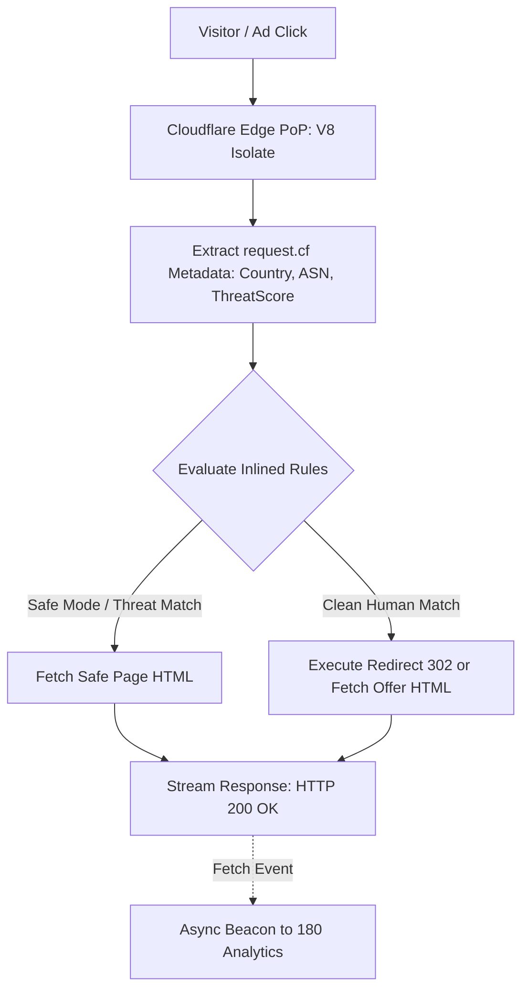

# Feature Specification: Cloudflare Edge Worker Gateway

## 1. Overview & Architectural Motivation

While the existing standalone PHP script enables deployment on any traditional web host, high-performance advertisers require **zero-origin deployments** that run entirely on Cloudflare's distributed edge network across 275+ global cities.

The **Cloudflare Edge Worker Gateway** feature will generate standalone, self-contained Cloudflare Worker scripts directly from the Traffic Director dashboard.

### Core Benefits
- **Zero Origin Server**: No web server, Nginx, or PHP runtime required. The worker runs directly on the edge.
- **Ultra-Low Latency**: Decisions are made inside Cloudflare V8 isolates in `< 0.5ms`.
- **Native Cloudflare Signals**: Access to Cloudflare's verified edge metadata (`request.cf.country`, `request.cf.asn`, `request.cf.asOrganization`, `request.cf.threatScore`, `request.cf.botManagement.score`).
- **Immunity to IP Bans**: The traffic director operates under Cloudflare's anycast IP pool.

---

## 2. Worker Execution Flow



---

## 3. Auto-Generated Worker Script Design

The Traffic Director backend will expose an endpoint `/api/v1/traffic-director/links/:linkId/export-worker` that produces a production-ready `worker.js` file:

```javascript
/**
 * Auto-generated by 180 Traffic Director
 * Link ID: link_893248923
 * Generated At: 2026-10-01T12:00:00Z
 */
const LINK_CONFIG = {
  slug: "promo-summer-2026",
  fallbackUrl: "https://myshop.com/safe-lander",
  blockDatacenter: true,
  blockVpn: true,
  blockSpy: true,
  rules: [
    {
      priority: 0,
      destinationUrl: "https://exclusive-offer.com/deal",
      actionType: "redirect",
      conditions: [
        { type: "geo", operator: "in", value: ["US", "CA", "GB"] },
        { type: "device", operator: "eq", value: "mobile" }
      ]
    }
  ]
};

export default {
  async fetch(request, env, ctx) {
    const cf = request.cf || {};
    const url = new URL(request.url);
    const country = cf.country || "UNKNOWN";
    const asn = cf.asn || 0;
    const ua = request.headers.get("user-agent") || "";

    // 1. Threat & Bot Detection via Cloudflare Signals
    const isBot = cf.botManagement && cf.botManagement.score < 30;
    const isDatacenter = [14618, 16509, 15169, 8075].includes(asn); // AWS, GCP, MSFT

    let matchedRule = null;
    if (!isBot && !isDatacenter) {
      for (const rule of LINK_CONFIG.rules) {
        // Evaluate conditions in-memory
        if (rule.conditions.every(cond => evaluateCondition(cond, { country, ua }))) {
          matchedRule = rule;
          break;
        }
      }
    }

    const targetUrl = matchedRule ? matchedRule.destinationUrl : LINK_CONFIG.fallbackUrl;
    const action = matchedRule ? matchedRule.actionType : "proxy";

    if (action === "redirect") {
      return Response.redirect(targetUrl, 302);
    } else {
      // In-Place Proxy Response
      const response = await fetch(targetUrl, {
        headers: { "User-Agent": ua }
      });
      return new Response(response.body, response);
    }
  }
};
```

---

## 4. Dashboard Implementation

The **Link Detail** page will feature an **"Edge Deployment"** tab:
1. **Download Worker (`worker.js`)**: Download the ready-to-run script.
2. **Deploy via Wrangler CLI**: Copy an automated `wrangler deploy` one-liner.
3. **Cloudflare API 1-Click Sync**: For users who save their Cloudflare API Token in 180 Workspace Settings, clicking "Deploy to Cloudflare" deploys the Worker to their Cloudflare account automatically.
