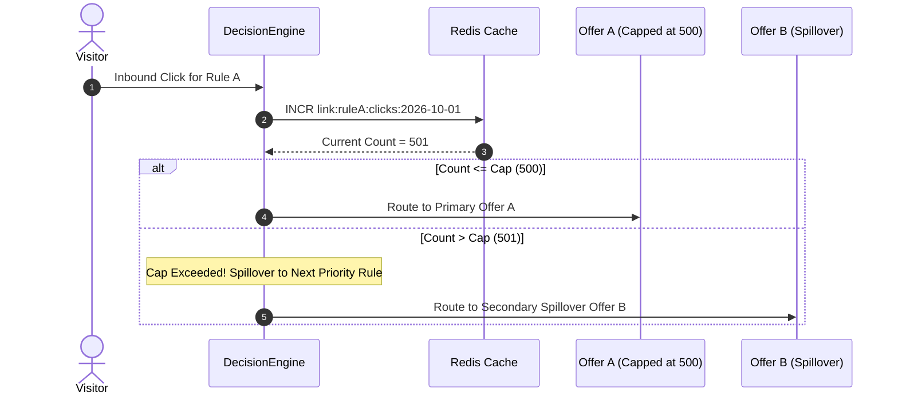

# Feature Specification: Rule Click Caps & Spillover Routing

## 1. Overview & Problem Statement

Affiliate networks, offer owners, and direct advertisers frequently enforce strict **traffic caps** (e.g., "Maximum 500 conversions or 2,000 clicks per day on Offer A"). 

If an advertiser's campaign generates 3,500 clicks in a day:
- In conventional systems, the surplus 1,500 clicks are wasted on Offer A without payout.
- With **Rule Click Caps & Spillover Routing**, the 180 Traffic Director automatically tracks click volume in real time. Once Rule A reaches its daily cap of 2,000 clicks, the engine automatically **spills over** remaining traffic to Rule B (a secondary offer or alternative network) without requiring manual campaign pauses.

---

## 2. Cap Types & Configuration

| Cap Type | Scope | Reset Interval | Use Case |
| :--- | :--- | :--- | :--- |
| **Daily Click Cap** | Per Rule | Every midnight (UTC or custom TZ) | Daily network offer allocations |
| **Total Lifetime Cap** | Per Rule | Never (Permanent limit) | Fixed-budget promotions, test allocations |
| **Hourly Velocity Cap** | Per Rule | Every 60 minutes | Pacing traffic to prevent advertiser server overload |

---

## 3. High-Performance Atomic Counter Architecture

To ensure high-throughput accuracy across concurrent requests without database locks, caps are tracked via atomic Redis `INCR` commands:



### Redis Key Lifecycle
- Key Format: `td:caps:{ruleId}:{YYYY-MM-DD}`
- Expiration: `86,400 + 3,600` seconds (25 hours) to ensure clean boundary transitions across timezones.
- Atomic evaluation using Redis pipeline:
  ```typescript
  const [currentCount] = await redis.multi()
    .incr(capKey)
    .expire(capKey, 90000)
    .exec();
  
  if (currentCount > rule.dailyCap) {
    // Spillover to next matching rule
  }
  ```

---

## 4. Proposed Database Schema Changes

```prisma
// Extension to packages/db/prisma/schema.prisma
model TrafficRule {
  id             String    @id @default(uuid())
  linkId         String
  name           String
  priority       Int       @default(0)
  isActive       Boolean   @default(true)
  destinationUrl String
  actionType     String    @default("redirect")
  conditions     Json

  // New Cap & Spillover Fields
  dailyCap       Int?      // Nullable: No cap if null
  totalCap       Int?      // Nullable: No lifetime limit if null
  currentClicks  Int       @default(0)
  spilloverMode  String    @default("next_rule") // 'next_rule', 'fallback', 'custom_url'
  spilloverUrl   String?   // Custom override URL if spilloverMode == 'custom_url'
}
```

---

## 5. UI/UX Interface

In the Rule Edit modal:
1. **"Enable Traffic Cap" toggle**: When switched on, reveals:
   - **Daily Limit Input**: Numeric field (e.g., `2,500` clicks).
   - **Spillover Action Dropdown**:
     - *Proceed to Next Rule (Recommended)*: Evaluates the next priority rule in the link list.
     - *Send to Safe Fallback*: Immediately routes to the Link's default safe page.
     - *Redirect to Dedicated Overflow URL*: Explicit URL destination.
2. **Live Progress Meter**: A visual progress bar on the Link Rules table showing `1,420 / 2,500 (56.8%)` with color-coded warning thresholds (Amber at 80%, Red at 100%).
