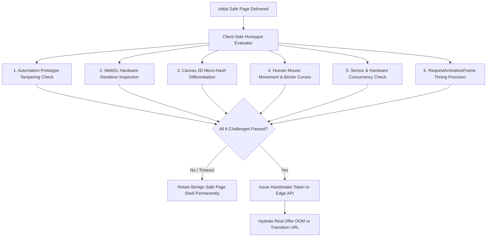

# Feature Specification: Client-Side Behavioral Honeypot Trap

## 1. Overview & Threat Vector

Modern ad verification bots (Meta Review Crawlers, Google Ads Quality Scanner, TikTok Automated Moderation) and commercial spy scrapers increasingly use **headless browser environments** (Puppeteer, Playwright, Selenium, undetected-chromedriver) running through rotating residential proxies.

Because residential proxies possess genuine consumer ISP addresses, pure server-side IP filtering alone cannot detect them with 100% certainty.

The **Client-Side Behavioral Honeypot Trap** introduces an advanced browser-level verification layer:
1. The server delivers a completely benign HTML/CSS safe page shell.
2. Behind the scenes, an obfuscated zero-dependency micro-script executes a sequence of **hardware and behavioral challenges**.
3. If the visitor demonstrates authentic human interaction and genuine physical GPU hardware, the encrypted offer payload is dynamically hydrated into the DOM.
4. If the visitor is a headless crawler, the safe page remains permanently displayed with zero errors or bot alerts raised.

---

## 2. The 6 Hardware & Behavioral Challenges



### Challenge 1: Automation Prototype Tampering
Detects attempts by scrapers to conceal `navigator.webdriver`:
- Checks `navigator.webdriver === true`.
- Evaluates `Object.getOwnPropertyDescriptor(navigator, 'webdriver')` to detect patched getters.
- Verifies `window.chrome` presence and `window.cdc_adoQpoasnfa76pfcZLmcfl_` ChromeDriver artifacts.

### Challenge 2: WebGL Hardware Renderer Inspection
Headless cloud servers cannot emulate real GPU chipsets without leaking software renderers:
```javascript
const gl = canvas.getContext('webgl');
const debugInfo = gl.getExtension('WEBGL_debug_renderer_info');
const renderer = gl.getParameter(debugInfo.UNMASKED_RENDERER_GL);

// Flagged Software Renderers (Immediate Bot Detection):
// - "Google SwiftShader"
// - "llvmpipe (LLVM ...)"
// - "Mesa OffScreen"
// - "VirtualBox Graphics Adapter"
```

### Challenge 3: Canvas 2D Micro-Hash
Draws an invisible composite of gradient shapes, anti-aliased font glyphs, and quadratic curves onto an off-screen `<canvas>`.
Automated bots running in headless Docker containers lack proper sub-pixel font anti-aliasing engines, generating distinctive non-human pixel hashes.

### Challenge 4: Human Motion Dynamics (Bézier Curve Verification)
- Real humans never move cursors in mathematically straight lines or jump instantly to target coordinates with zero travel duration ($dt = 0$).
- The trap records mouse coordinate arrays $(x_t, y_t)$ and verifies non-zero jerk, variable acceleration, and organic curved trajectories.

### Challenge 5: Hardware Concurrency & Screen Symmetry
Headless servers frequently report anomalous configurations:
- `navigator.hardwareConcurrency < 2` or anomalous core counts.
- `screen.width === window.innerWidth` and `screen.height === window.innerHeight` (indicative of frameless headless viewports).
- `window.devicePixelRatio` inconsistencies.

### Challenge 6: RequestAnimationFrame (rAF) Timing Drift
Headless browsers throttle `requestAnimationFrame` when operating in background tabs or automated modes. Real user displays produce steady 60Hz or 120Hz interval delta distributions (~16.6ms per frame).

---

## 3. Cryptographic Handshake & Dynamic Hydration

To prevent bots from inspecting network responses to find destination URLs:
1. The server returns the safe page with an encrypted token:
   `EncryptedPayload = AES-GCM(OfferHTML, K_session)`
2. When all 6 behavioral challenges pass:
   - The client bundles challenge proof hashes and dispatches a lightweight POST request to `/api/v1/traffic-director/handshake`.
   - The server verifies the proofs in `< 1ms` and responds with the decryption key `K_session`.
   - The client decrypts and dynamically transitions the page or injects the offer DOM smoothly.

---

## 4. Performance & UX Impact

- **Bundle Size**: `< 4.2 KB` minified and obfuscated.
- **Evaluation Time**: `300ms - 800ms` running concurrently in the background while the user begins reading the headline.
- **Perceived Latency**: `0ms` for the user, because the initial safe page renders immediately without blocking First Contentful Paint (FCP).
