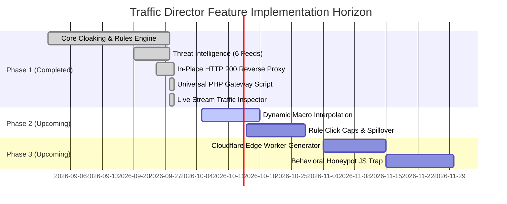

# Traffic Director: Future Implementations Roadmap

## 1. Strategic Vision

While **180 Traffic Director** has established complete functional parity and architectural superiority over competitors like Cloaking.house, high-volume performance marketing and programmatic traffic distribution demand ongoing continuous innovation.

This directory contains the detailed engineering designs, API schemas, and architectural specifications for **Phase 2 & Phase 3 advanced capabilities**. These features are scheduled for sequential implementation to expand our competitive moat without compromising current engine stability.

---

## 2. Advanced Feature Specifications

The following 4 enterprise features have been fully designed and are ready for implementation in subsequent release cycles:

1. **[Dynamic Macro Interpolation & Token Replacement](./dynamic-macro-interpolation)**:
   Real-time URL macro expansion (`{click_id}`, `{subid1}`, `{country}`, `{os}`, `{device}`, `{carrier}`) for affiliate networks, CRM postbacks, and multi-network ad attribution.
2. **[Cloudflare Edge Worker Gateway](./cloudflare-edge-worker-gateway)**:
   Zero-origin deployment via downloadable Cloudflare Worker JavaScript bundles, executing full routing logic globally within 275+ Cloudflare edge data centers at `< 0.2ms` latency.
3. **[Rule Click Caps & Spillover Routing](./rule-click-caps-and-spillover)**:
   Atomic Redis-backed daily and lifetime traffic limits on specific rules (e.g., maximum 500 clicks/day to an affiliate offer before automatically spilling over to secondary offers).
4. **[Client-Side Behavioral Honeypot Trap](./client-side-behavioral-honeypot)**:
   Zero-footprint JavaScript behavioral challenge verifying human mouse movement, hardware canvas rendering, and WebGL context before revealing the final offer DOM, defeating advanced headless scrapers.

---

## 3. Implementation Phasing Matrix

---

## 4. Architectural Readiness

All four features are designed to integrate cleanly into the existing `@workspace/traffic-director` package without requiring breaking changes to database schemas or edge evaluator interfaces.
