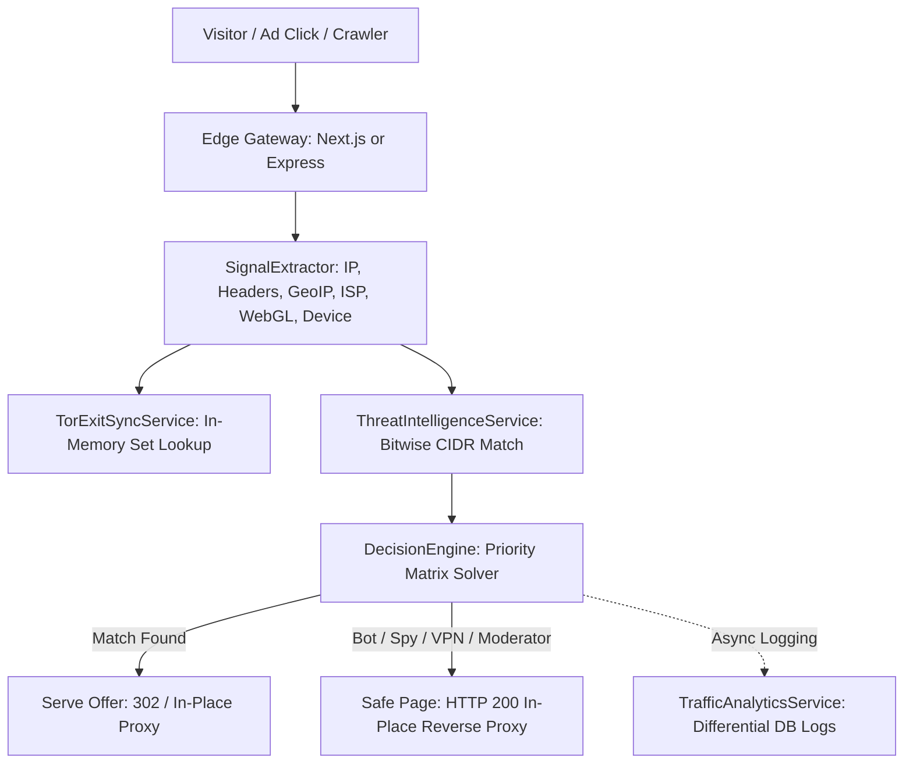

# 180 Traffic Director & Advanced Cloaking Engine

## 1. System Overview

**180 Traffic Director** is an enterprise-grade conditional traffic routing, bot/moderator protection, differential evaluation, and edge cloaking platform engineered directly into the 180 Workspace monorepo.

Designed to outperform specialized standalone tools like [Cloaking.house](https://cloaking.house/), Traffic Director provides sovereign advertisers, media buyers, affiliate marketers, and growth teams with high-speed, sub-millisecond traffic filtering without external subscriptions or flow caps.

---

## 2. Documentation Navigation

This section contains the complete technical specifications and research papers for the Traffic Director subsystem:

1. **[Core System Architecture](./traffic-director-architecture)**:
   Multi-persona architectural specification, data flow diagrams, database models, and service interfaces.
2. **[Web Cloaking & Content Delivery Research](./web-cloaking-research)**:
   Foundational technical and mathematical analysis of web cloaking, detection mechanics, and reverse proxy techniques.
3. **[Cloaking Superiority Analysis](./cloaking-superiority-matrix)**:
   Full side-by-side feature matrix against Cloaking.house, verifying 100% parity and technical superiority.
4. **[Threat Intelligence & Feeds Specification](./threat-intelligence-specification)**:
   Architecture of the 6 system threat feeds, bitwise IPv4 CIDR matching, Tor exit node background synchronization, and tenant custom blacklists.
5. **[Edge Evaluator & Gateway Architecture](./edge-evaluator-proxy-architecture)**:
   Underlying mechanics of `SignalExtractor`, `DecisionEngine`, HTTP 200 Reverse Proxying, and standalone zero-dependency PHP generation.
6. **[Future Implementations Roadmap](./future-implementations/)**:
   Detailed designs and specifications for upcoming high-value features (Dynamic Macro Interpolation, Cloudflare Edge Workers, Rule Click Caps, and Headless Behavioral Honeypots).

---

## 3. Architecture at a Glance

---

## 4. Key Performance Metrics

- **Edge Evaluation Latency**: `< 1ms` in-memory processing.
- **Threat CIDR Matching**: Bitwise unsigned integer masking executed in `< 0.05ms`.
- **Tor Exit Directory Sync**: Background polling every 4 hours caching ~1,850+ exit nodes in an $O(1)$ memory set.
- **Database Overhead**: Zero database queries during edge evaluation (pure in-memory rule cache & synchronous pass-through).
