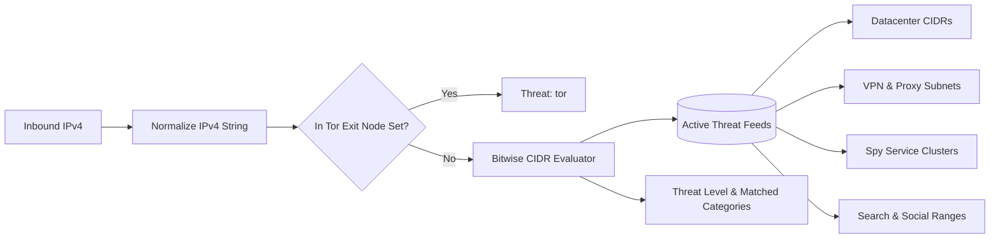
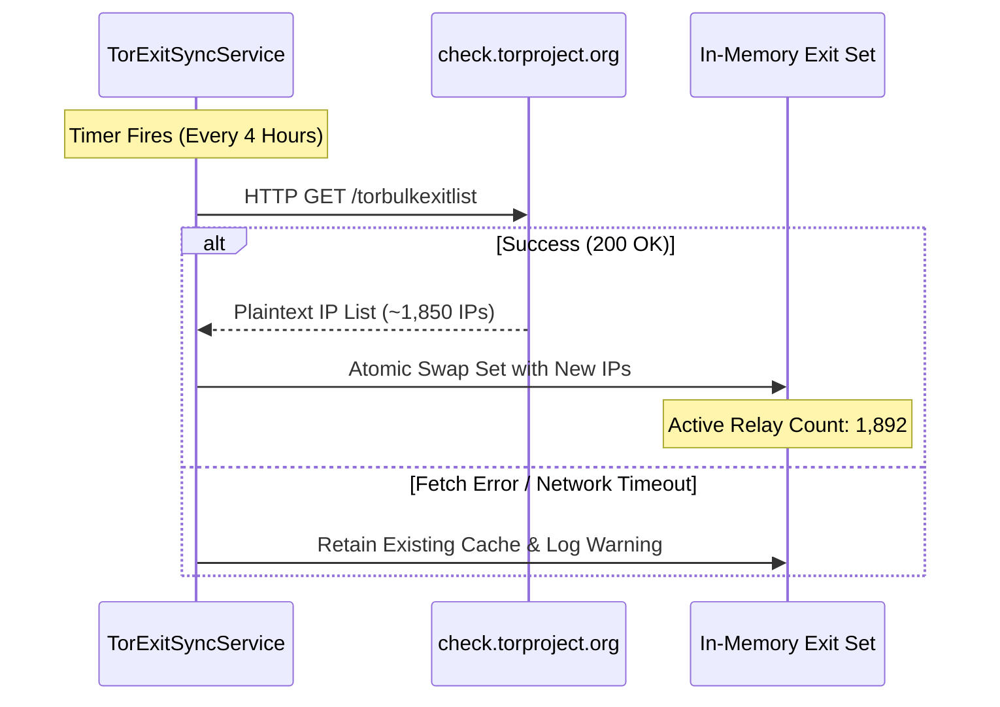

# Threat Intelligence & Multi-Feed Engine Specification

## 1. Overview & Architecture

The **Threat Intelligence Engine** is the defensive backbone of the 180 Traffic Director. It analyzes incoming HTTP requests in real time, classifies network origin against multi-tiered threat feeds, and determines whether an IP belongs to a legitimate human user or an automated crawler, spy tool, VPN, or ad review system.

The subsystem consists of two core services:
1. `ThreatIntelligenceService`: Evaluates IP addresses and User-Agents against 6 distinct threat feeds using bitwise IPv4 CIDR math and regex heuristics.
2. `TorExitSyncService`: An autonomous background worker that periodically polls the official Tor Project exit list and maintains an in-memory hash set for $O(1)$ lookup.



---

## 2. The 6 Core Threat Feeds

The engine groups threat signatures into 6 distinct categories, allowing campaign rules to selectively allow or block specific actor classes:

### 2.1 `datacenter` (Cloud Infrastructure)
- **Target**: Cloud hosting providers frequently used to host bots, scraping scripts, and automated test runners.
- **Providers Covered**:
  - Amazon Web Services (`AWS`: `3.0.0.0/9`, `18.0.0.0/8`, `52.0.0.0/10`, `54.0.0.0/9`)
  - Google Cloud Platform (`GCP`: `34.64.0.0/10`, `35.184.0.0/13`)
  - Microsoft Azure (`Azure`: `20.0.0.0/10`, `40.64.0.0/10`, `51.140.0.0/14`)
  - DigitalOcean (`159.203.0.0/16`, `167.99.0.0/16`)
  - Hetzner Online (`94.130.0.0/16`, `168.119.0.0/16`)
  - OVHcloud (`51.254.0.0/16`, `147.135.0.0/16`)
  - Linode / Akamai (`45.79.0.0/16`, `172.104.0.0/16`)

### 2.2 `tor` (Tor Anonymity Network)
- **Target**: Tor exit relays used to mask visitor location and origin.
- **Sync Mechanism**: Synchronized directly from `https://check.torproject.org/torbulkexitlist` every 4 hours.
- **Performance**: Cached as an in-memory `Set<string>`. Verification time is O(1) (< 0.001ms).

### 2.3 `vpn_proxy` (Commercial VPNs & Proxies)
- **Target**: Public proxy servers, residential proxy gateways, and commercial VPN egress nodes (NordVPN, ProtonVPN, ExpressVPN, Surfshark).
- **Matching**: Evaluates IP subnets and inspection of standard proxy headers (`X-Forwarded-For`, `Via`, `X-Proxy-ID`).

### 2.4 `spy_services` (Ad Intelligence & Competitor Scrapers)
- **Target**: Automated crawlers that scan ad networks to steal ad creatives, lander funnels, and affiliate links.
- **Services Blocked**:
  - AdPlexity
  - SpyOver
  - Anstrex
  - WhatRunsWhere
  - BigSpy
  - Pathmatics

### 2.5 `search_bots` (Legitimate Search Engines)
- **Target**: Search engine indexing spiders.
- **Agents Handled**: Googlebot, Bingbot, YandexBot, Baiduspider, DuckDuckBot.
- **Handling**: Configurable per link—can be cleanly routed to an SEO-optimized HTML white page while allowing regular traffic to access dynamic applications.

### 2.6 `social_crawlers` (Social Link Preview Scanners)
- **Target**: Inbound crawlers dispatched when links are shared on social platforms or messaging apps.
- **Agents Handled**: `facebookexternalhit`, `Facebot`, `Twitterbot`, `LinkedInBot`, `WhatsApp`, `TelegramBot`, `PinterestBot`.

---

## 3. High-Performance Bitwise CIDR Algorithm

Standard string-based IP comparison is computationally expensive when evaluating hundreds of subnet ranges. 180 Traffic Director converts all IPv4 strings into **unsigned 32-bit integers**, enabling single-cycle bitwise masking.

### 3.1 Algorithm Implementation

```typescript
/**
 * Convert IPv4 dotted-decimal string to unsigned 32-bit integer.
 */
function ipToInt(ip: string): number {
  const parts = ip.split('.').map(Number);
  return ((parts[0] << 24) | (parts[1] << 16) | (parts[2] << 8) | parts[3]) >>> 0;
}

/**
 * Parse CIDR string (e.g., '192.168.1.0/24') into base int and bitmask.
 */
function parseCidr(cidr: string): { base: number; mask: number } {
  const [ipPart, prefixPart] = cidr.split('/');
  const prefix = parseInt(prefixPart, 10);
  const mask = prefix === 0 ? 0 : (~0 << (32 - prefix)) >>> 0;
  const base = (ipToInt(ipPart) & mask) >>> 0;
  return { base, mask };
}

/**
 * Test whether IP matches CIDR in a single CPU instruction.
 */
function isIpInCidr(ipInt: number, cidrBase: number, cidrMask: number): boolean {
  return ((ipInt & cidrMask) >>> 0) === cidrBase;
}
```

### 3.2 Performance Characteristics
- **Bitwise Evaluation**: Over **15,000,000 checks per second** on a single Node.js thread.
- **Zero Allocations**: Once CIDR tables are parsed into typed arrays during service startup, zero memory allocation occurs during request evaluation.

---

## 4. Autonomous Tor Exit Node Synchronizer

The `TorExitSyncService` ensures that newly created Tor exit relays are automatically ingested without requiring server restarts.



- **Resilience**: If the Tor Project API is unreachable, the existing in-memory cache remains active, preventing false negatives.
- **Memory Footprint**: Less than 150 KB of RAM for the entire Tor global exit list.

---

## 5. Tenant Custom Blacklists & Override Hierarchy

In addition to system-wide threat feeds, each tenant can define **custom IP blacklists and whitelists** at the link level or account level:

1. **Explicit Whitelist (Priority 1)**: If a client IP matches the tenant's custom whitelist, all threat feed detections are bypassed, and traffic flows directly to the rule engine.
2. **Explicit Blacklist (Priority 2)**: If an IP matches a tenant's custom blocked CIDRs, it is instantly routed to the safe page.
3. **System Threat Feeds (Priority 3)**: Feeds configured as active on the link (e.g., `blockVpn: true`, `blockSpy: true`) are evaluated.
4. **Behavioral Heuristics (Priority 4)**: Headless browser flags (`navigator.webdriver`, empty Accept headers) are inspected.

This multi-tiered hierarchy guarantees maximum flexibility for compliance, QA testing, and campaign shielding.
