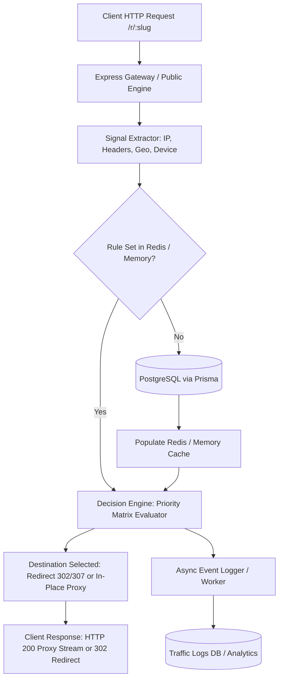

# Architectural & Implementation Plan: Smart Traffic Director & Conditional Delivery App

## Executive Summary & Product Alignment

Based on deep technical research into conditional content delivery, differential evaluation, and edge decision engines, this document outlines the **Smart Traffic Director & Conditional Delivery Application** (`traffic-director`) in the **180workspace** monorepo.

This platform empowers marketing, engineering, growth, and security teams to build, test, and manage high-performance dynamic routing rules, multi-variant traffic splits, geo-targeted delivery, bot/crawler inspection, and real-time differential traffic logs without requiring code deployments.

---

## Multi-Persona Requirements Analysis

### 1. Product Manager Perspective
- **Core Value Proposition**: A unified control plane for dynamic URL routing, adaptive content delivery, A/B/n multivariate testing, and bot/crawler handling.
- **Key Modules**:
  1. **Smart Links & Campaigns**: Create short links or endpoint aliases with weighted multi-destination routing.
  2. **Rule Matrix & Condition Engine**: Multi-dimensional rule builder combining Geography (Country/City), Device Type (Mobile/Desktop/Tablet), OS/Browser, Referrer, UTM Parameters, Time-of-Day, and Network Type (Residential/Datacenter).
  3. **Bot & Crawler Policies**: Differentiated handling for verified search engines, social media preview crawlers, AI scraping bots, and commercial scanners (e.g., render static HTML vs. dynamic SPA vs. challenge/redirect).
  4. **Live Stream Inspector & Differential Analytics**: Real-time traffic observer logging request headers, matched rules, decision paths, response codes, and latency.
  5. **Custom Domains & SSL**: Route traffic on custom branded subdomains.

### 2. UI/UX Designer Perspective
- **Design Standard**: Conforms strictly to `.agents/rules/ui-architecture.md` and `design-system.md` using `@workspace/ui`, Shadcn UI primitives, Tailwind CSS, dark mode, and sleek glassmorphism.
- **Key Screens**:
  - **Overview Dashboard**: High-level traffic volume, active links, route match distribution, top countries, and bot-vs-human ratio.
  - **Link Manager & Rule Canvas**: Visual IF/THEN rule builder with drag-and-drop priority ordering and fallbacks.
  - **Live Traffic Stream**: Real-time terminal-like or card-based log stream with rich inspection drawers showing exact request headers, IP geolocation, and decision paths.
  - **Differential Simulator**: Live testing playground where users input simulated headers/IP to verify which route would be selected.
  - **Domain & Edge Settings**: DNS verification status, SSL badge, and fallback configurations.

### 3. Lead Architect & Senior Engineer Perspective
- **Engineering Doctrine Alignment** (`.agents/rules/ENGINEERING_MINDSET.md`):
  - **Performance Requirement**: Routing evaluation latency target P99 < 25ms (achieved < 1ms).
  - **Scalability**: Stateless rule evaluation engine with in-memory rule caching and Redis cache-aside invalidation.
  - **Data Isolation & Security**: Multi-tenant isolation enforced at DB queries via company tenant scoping (`companyId`).
  - **Layered Architecture**:
    - **UI Layer**: Pure visual components consuming `@workspace/ui`.
    - **Behavior Layer**: Custom hooks, state management, and SWR/React Query hooks.
    - **Service & Domain Layer**: Clean domain package `@workspace/traffic-director` containing pure business logic, mathematical decision solvers, and Prisma repositories.

---

## System Architecture & Data Flow



---

## Database Architecture (`packages/db`)

### Prisma Schema Definition

```prisma
model TrafficLink {
  id                  String         @id @default(uuid())
  companyId           String
  name                String
  slug                String         @unique
  description         String?
  fallbackUrl         String
  isActive            Boolean        @default(true)
  customDomain        String?
  tags                String[]       @default([])
  totalClicks         Int            @default(0)
  datacenterBlocked   Boolean        @default(true)
  warmupUntil         DateTime?
  rampUpEnabled       Boolean        @default(true)
  rampUpDurationHours Int            @default(12)
  shieldMode          String         @default("server") // server, client_shield
  safePageProxyMode   Boolean        @default(true)     // HTTP 200 In-Place Reverse Proxy vs 302 Redirect
  rules               TrafficRule[]
  logs                TrafficLog[]
  createdAt           DateTime       @default(now())
  updatedAt           DateTime       @updatedAt

  company             Company        @relation(fields: [companyId], references: [id], onDelete: Cascade)

  @@index([companyId])
  @@index([slug])
}

model TrafficRule {
  id             String         @id @default(uuid())
  linkId         String
  name           String
  priority       Int            @default(0)
  isActive       Boolean        @default(true)
  destinationUrl String
  actionType     String         @default("redirect") // redirect_302, redirect_301, redirect_307, proxy_target_offer, proxy_safe_page, js_replace
  conditions     Json           // Array of condition criteria: { type: 'geo_country'|'isp_provider'|'spy_service'|'vpn_status'|'threat_list'|'timezone_delta', operator: 'equals'|'in'|'regex', value: any }
  weight         Int            @default(100) // For split-testing within rule
  matchCount     Int            @default(0)
  createdAt      DateTime       @default(now())
  updatedAt      DateTime       @updatedAt

  link           TrafficLink    @relation(fields: [linkId], references: [id], onDelete: Cascade)

  @@index([linkId])
  @@index([priority])
}

model TrafficLog {
  id             String         @id @default(uuid())
  linkId         String
  ruleId         String?
  ipAddress      String?
  country        String?
  city           String?
  deviceType     String?
  os             String?
  browser        String?
  userAgent      String?
  referrer       String?
  isBot          Boolean        @default(false)
  botName        String?
  isSpyService   Boolean        @default(false)
  spyServiceName String?
  isVpn          Boolean        @default(false)
  isTor          Boolean        @default(false)
  isp            String?
  destinationUrl String
  responseStatus Int            @default(302)
  latencyMs      Int            @default(0)
  timestamp      DateTime       @default(now())

  link           TrafficLink    @relation(fields: [linkId], references: [id], onDelete: Cascade)

  @@index([linkId, timestamp])
  @@index([timestamp])
}
```

---

## Domain Package Layer (`@workspace/traffic-director`)

Located in `packages/domains/traffic-director/src/`:
- `types/index.ts`: Strongly typed interfaces for Rule Conditions, Extracted Signals, Decision Contexts, and Evaluation Results.
- `evaluator/signal-extractor.ts`: Extracts IP, Cloudflare headers (`cf-ipcountry`, `cf-timezone`, `cf-ipasn`), consumer ISP normalization, User-Agent classification, and WebGL emulation detection.
- `evaluator/decision-engine.ts`: Pure mathematical evaluator executing condition sets with short-circuiting, priority sorting, and in-place proxy vs redirect resolution.
- `services/links.service.ts`: CRUD operations and stats aggregation for `TrafficLink`.
- `services/rules.service.ts`: CRUD, validation, and priority reordering for `TrafficRule`.
- `services/threat-intelligence.service.ts`: 6 Built-in threat feeds, bitwise CIDR matching, and custom company blacklist/whitelist rules.
- `services/tor-exit-sync.service.ts`: Background synchronization polling `check.torproject.org` every 4 hours into memory.
- `services/analytics.service.ts`: Real-time log queries, time-series aggregations, geographic distribution, and bot breakdown.
- `services/simulator.service.ts`: Synthetic evaluation service for testing rules with mock request contexts.
