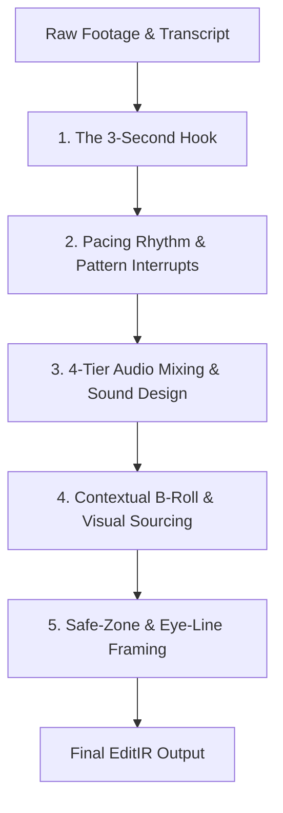

# AI Director Consciousness & Open-Source Media Ecosystem

> **Architecture Document**: Cognitive Directing Model, Cinematic Rules, and Catalog of Free / Zero-API / Open-Source Tools for the 180 Workspace AI Director.

---

## 1. Executive Summary

The **AI Director** inside 180 Workspace is an autonomous video directing and editing intelligence. It does not blindly generate random pixels; it acts as a senior film director, lead editor, and sound designer. It analyzes spoken audio transcripts, silences, face bounding boxes, energy peaks, and scene cuts, and then orchestrates deterministic timeline operations (`CreativeOperation` AST).

This document establishes the **Cinematic Consciousness** that governs the AI Director's decisions, alongside an exhaustive index of **open-source, public domain, zero-API, and unlimited-API resources** for B-roll, visual effects, and sound design.

---

## 2. The AI Director's Cinematic Consciousness

The AI Director operates under 5 core cinematic and retention principles:



### 2.1 The 3-Second Retention Hook
In modern short-form video (TikTok, Instagram Reels, YouTube Shorts), 65% of viewer drop-off occurs within the first 3 seconds. The AI Director is consciously trained to:
1. **Eliminate Head-Dead Air at $t=0$**: Never allow more than 80ms of silence before the first word is spoken. The intro is micro-trimmed immediately to the first active phonetic syllable.
2. **Instant Visual Pattern Interrupt ($t \le 1.5\text{s}$)**: Trigger an initial punch-in camera zoom (`addZoom` 1.15x–1.25x on the speaker's face) or place a curiosity-inducing B-roll teaser in the opening moments.
3. **Acoustic Hook Punctuation**: Pair the opening zoom with an acoustic transient (`addSoundEffect` with `whoosh` or `pop`) to engage both visual and auditory attention channels.
4. **Immediate Kinetic Title / Caption**: Render the opening sentence in bold centered subtitles or a punchy headline title card.

### 2.2 Pacing Rhythm & Pattern Interrupts
Human visual habituation sets in after **2.5 to 3.5 seconds** of a static shot. A conscious director never leaves the timeline unchanged for longer than 4 seconds.

- **The Rhythm Cycle**:
  $$\text{Main Camera} \longrightarrow \text{Punch-in Zoom (Emphasis)} \longrightarrow \text{B-Roll Cutaway (Concept Visual)} \longrightarrow \text{Word Pop Highlight} \longrightarrow \text{Return to Speaker}$$
- **Genre-Specific Pacing Profiles**:
  - **Fast / Viral (`MRBEAST_FAST`, `HORMOZI_PUNCH`)**: Sentence pauses cut to $<300\text{ms}$, zooms every 2–3s, word-by-word kinetic captions with bright yellow/cyan highlight colors, frequent punctuation SFX.
  - **Clean / Educational (`ALI_ABDAAL_CLEAN`, `VOX_EXPLAINER`)**: Sentence pauses preserved naturally (350–500ms), gentle J-cuts and L-cuts, lower-third explanatory titles, elegant muted B-roll, soft background music bed.
  - **Cinematic / Narrative (`IMAN_GADZHI_CINEMATIC`, `DOCUMENTARY_DEEPDIVE`)**: Teal/Orange or Noir grade, atmospheric slow-motion B-roll, sub-bass drops on thesis statements, longer sustained shots (3.5–5.0s).

### 2.3 4-Tier Audio Mixing & Sound Design Architecture
Amateur video editors treat audio as a single track. The AI Director enforces a **4-tier hierarchical audio mix**:

| Tier | Audio Layer | Processing & Balancing | Role in Narrative |
| :--- | :--- | :--- | :--- |
| **Tier 1** | **Primary Voice (Dialog)** | Normalized to -14 LUFS, prioritized, never masked. | Core message and vocal clarity. |
| **Tier 2** | **Background Music (BGM)** | Ducked by **-18 dB to -22 dB** beneath speech; swells by +6 dB during B-roll cutaways or pauses. | Establishes mood, rhythm, and emotional valence. |
| **Tier 3** | **Punctuation SFX** | Whooshes at -8 dB on zooms/cuts; UI pops at -10 dB on text cards; sub-bass drops at -6 dB on punchlines. | Physical tactile feedback that anchors visual motion. |
| **Tier 4** | **Atmosphere / Room Tone** | Ambient bed maintained across cuts. | Prevents abrupt silence dropouts between edited sentences. |

### 2.4 Safe-Zone & Eye-Line Framing
When reframing horizontal 16:9 footage into vertical 9:16:
- **Eye-Line Rule**: The speaker's eyes should align at **38% from the top of the canvas** (golden ratio for vertical portraiture).
- **Social UI Safe Zones**: Keep all essential elements (captions, face, titles) within the central 60% vertical safe area, strictly avoiding:
  - Top 10%: Smartphone status bar and account header.
  - Bottom 20%: Caption overlay, creator username, sound title, platform scrubber.
  - Right 15%: Like, Comment, Bookmark, Share icons.

---

## 3. Catalog of Free, Zero-API & Unlimited-API Resources

Below is the verified ecosystem of tools and sources available to the AI Director:

### 3.1 Sound Effects (SFX) & Audio Archives

| Tool / Provider | API Key Required? | Cost / Terms | Content Type | How AI Director Uses It |
| :--- | :--- | :--- | :--- | :--- |
| **NASA Audio Archive** (`images-api.nasa.gov`) | **No (Zero Key)** | 100% Free Public Domain (US Govt) | Historic rocket launches, countdowns, control room telemetry, planetary frequencies, radio chatter ("Houston", Apollo). | Integrated in `free-media-providers.ts` under `provider: "nasa"`. Used for tech, science, dramatic space, and countdown moments. |
| **FreePD** (`freepd.com`) | **No (Zero Key)** | 100% CC0 Public Domain | Direct MP3s: Cinematic, Horror, Comedy, Upbeat, Electronic music and stinger beds. | Zero copyright claims, zero attribution required. Ideal for high-stakes commercial client videos. |
| **BBC Sound Effects Archive** (BBC Rewind) | **No (Direct Open Access)** | Free for personal, research & open licensing (16,000+ clips) | 33,000+ broadcast-grade field recordings: natural environments, footsteps, crowds, machinery, vintage vehicles, room tones. | Unmatched authentic acoustic textures for narrative storytelling. |
| **Sonniss GDC Game Audio Archives** | **No (Direct Archive)** | 100% Royalty-Free Commercial (150+ GB) | AAA game studio sound libraries: whooshes, impacts, UI clicks, magic spells, sci-fi sweeps, mechanical doors, explosions. | Source files for high-impact viral video sound punctuation. |
| **Procedural Audio Synthesizer** (On-Device DSP) | **No (Offline / Local)** | 100% Zero-Latency, Zero-Cost | Mathematically generated acoustic waveforms (48kHz WAV): whooshes, UI pops, risers, sub-drops, white noise sweeps. | Built into `FreesoundSfxTool` and `EditIRCompiler.applySoundDesign` when offline or when zero-latency is demanded. |
| **Freesound API** (`freesound.org`) | `FREESOUND_API_KEY` (Free) | Creative Commons (CC0, CC BY) | Crowd-sourced organic sound effects: real whooshes, camera shutters, paper crinkles, street ambiances. | Queried via `FreesoundSfxTool` for authentic acoustic matches. |

### 3.2 Visual Effects (VFX) & B-Roll Libraries

| Tool / Provider | API Key Required? | Cost / Terms | Content Type | How AI Director Uses It |
| :--- | :--- | :--- | :--- | :--- |
| **NASA Imagery & Video API** (`images-api.nasa.gov`) | **No (Zero Key)** | 100% Free Public Domain (US Govt) | 4K & HD video clips: Earth orbit timelapses, rocket staging, spacewalks, aurora borealis, satellite telemetry. | Integrated into `searchFreeMedia({ kind: "video" })`. Instantly provides jaw-dropping real footage for science, tech, global, or climate topics. |
| **Wikimedia Commons API** (`commons.wikimedia.org`) | **No (Zero Key)** | Public Domain, CC0, CC BY | Millions of historical film cutaways, architecture, world cultures, nature, scientific diagrams. | Integrated in `free-media-providers.ts` (`WikimediaCommonsProvider`). |
| **Internet Archive Prelinger Archives** (`archive.org`) | **No (Zero Key)** | Public Domain | 60,000+ historical American educational films, vintage commercials, retro technology, mid-century culture. | Perfect for nostalgic, satirical, historical, and narrative contrast cutaways. |
| **Pexels Video & Photo API** (`pexels.com`) | `PEXELS_API_KEY` (Free) | Free Commercial Use | 4K & HD modern lifestyle, business, tech, aerial drone footage, cityscapes, fitness. | Primary commercial stock video provider via `PexelsClient.searchStock`. |
| **Pixabay Video & Vector API** (`pixabay.com`) | `PIXABAY_API_KEY` (Free) | Free Pixabay License | HD stock videos, motion animations, vector illustrations, transparent PNG overlays. | Multi-resource provider via `PixabayClient.searchStock`. |
| **Coverr.co & Mixkit** | **No API Needed** | Free Commercial License | Video loops, light leaks, bokeh particle overlays, smoke, vintage film grain burns. | Overlay footage used for visual flair and analog textures. |

---

## 4. Director Tool Registry Mapping

The AI Director executes its consciousness through the following tools:

```typescript
// Tool specifications exposed to the LLM Planner
export const DIRECTOR_TOOL_SPECS = [
  // Sound Design & Audio Consciousness
  { name: "autoSoundDesign", description: "Automatically synthesize acoustic sound design (whooshes on zooms, pops on captions, sub-drops on punchlines)." },
  { name: "addSoundEffect", description: "Place a specific acoustic sound effect (whoosh, pop, sub_drop, riser, impact, glitch, bell) at a precise timeline second." },
  { name: "addBackgroundMusic", description: "Add a background music bed with automatic speech ducking (-18dB beneath voice)." },
  { name: "duckAudio", description: "Duck existing background music beneath vocal speech." },

  // Visual Pacing & B-Roll Sourcing
  { name: "insertBroll", description: "Overlay context-matched B-roll footage from Pexels, Pixabay, NASA, or Wikimedia." },
  { name: "addZoom", description: "Punch-in camera zoom (1.15x-1.3x) centered on speaker's face for emphasis on punchlines." },
  { name: "addTransition", description: "Add cut transitions (ZOOM_SWOOSH, CROSSFADE, BLUR_PUNCH, SLIDE_LEFT)." },

  // Typography & Subtitles
  { name: "autoCaptions", description: "Generate kinetic, word-synced animated subtitles (Hormozi, Ali Abdaal, or Minimalist)." },
  { name: "addText", description: "Add a title or lower-third text overlay for chapter headings or key quotes." },

  // Framing & Trimming
  { name: "reframeSubject", description: "Reframe and track subject face for 9:16 vertical canvas." },
  { name: "removeSilences", description: "Remove dead air and hesitation pauses with safe padding so words are never clipped." },
  { name: "cleanFillers", description: "Cut vocal filler words ('um', 'uh', 'ah') based on phonetic transcript." },
  { name: "changeSpeed", description: "Speed up or slow down footage (e.g. 1.1x speed boost for conversational snap)." },
  { name: "applyFilter", description: "Color grade preset (CINEMATIC_TEAL_ORANGE, NOIR_BW, VIVID, VINTAGE_WARM, GLOW)." },
  { name: "finish_edit", description: "Conclude edit plan with an articulate, friendly summary of creative changes." }
];
```

---

## 5. Verification & Testing Standards

1. **Deterministic Fallbacks**: Every networked stock search (Pexels, Pixabay, NASA, Freesound) has a 6-second timeout and falls back gracefully to offline procedural synthesis or local cache. Network failures never crash an edit.
2. **License Safety**: Only CC0, Public Domain, and commercial-safe CC BY licenses are accepted. Non-commercial (NC) and No-Derivatives (ND) files are rejected at the normalization layer.
3. **Audio Integrity**: BGM tracks never exceed -16dB during speech; dialog tracks are never muted unless explicitly detached by the user.
